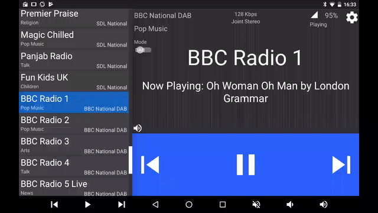
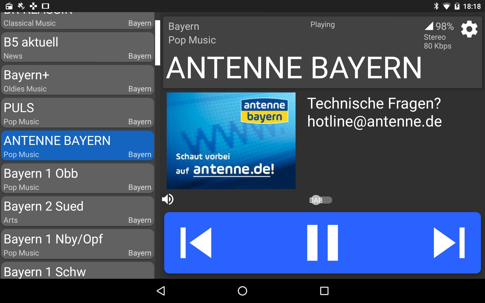
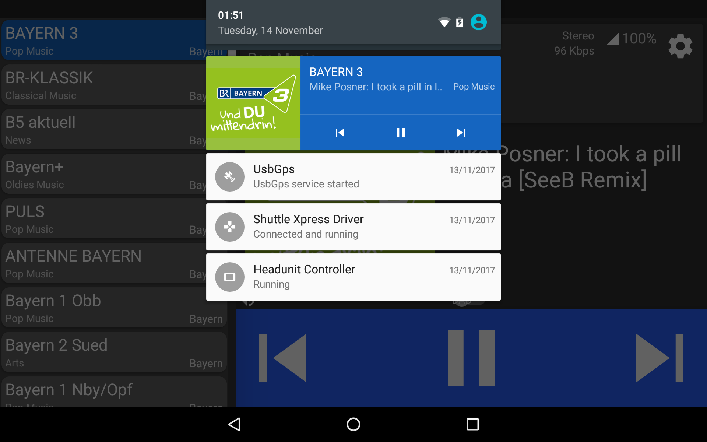
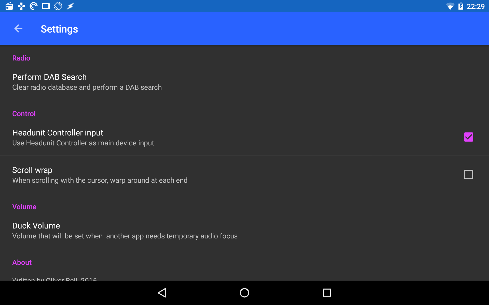
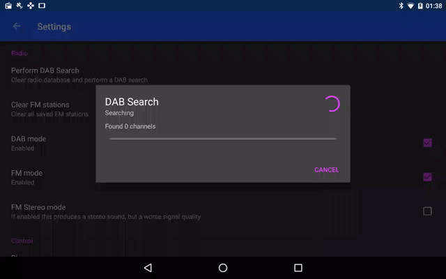
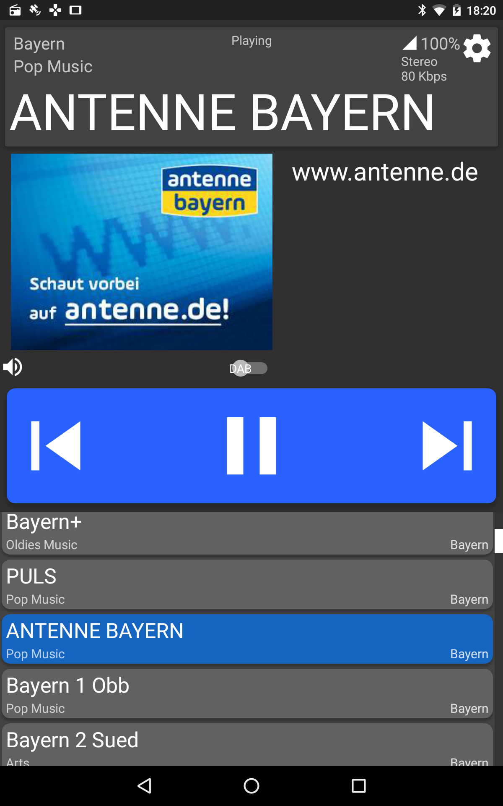

# Monkeyboard - DAB/DAB+ & FM radio for android

[Latest Releases](/releases)

Builds have only been tested on android 5.1 and 6.0, 

If the app crashes on your system submit an issue with a full log file (Google it if you dont know how to do this)

## About

A [Monkeyboard](http://www.monkeyboard.org/products/85-developmentboard/80-dab-fm-digital-radio-development-board) (Keystone radio) is a full DAB/DAB+ & FM radio on a circuitboard.

This app interfaces with a Monkeyboard and provides a control and feedback interface for the user. The Monkeyboard communicates via USB serial, and so to use the board a USB Host cable is required to connect the board to the android device.

The app is designed to act as if it is a normal music player as so will act accordingly. Audio focus will be followed, and a mediaplayer notification is provided. 

The Monkeyboard does not transmit audio over the USB connection, it is only outputted directly from the board itsself. The user will need to mix this audio with the tablet audio externally. (Think of the android device as being a screen for the Monkeyboard)

The interface is designed to work on all device sizes.

## Features

- DAB Slideshow! This streams an image, broadcast by the radio station, from the board and displays it along side the program text information. **This does not require internet**
- DAB Program text
- FM RDS information
- Radio station list. Editable FM saved stations list
- Player notificiation controls
- Automatic android audio handling (Radio will not play over the top of any other android audio)
- Support for media button input. As well as others keyboard input (TAB to scrolldown the station list, UP Arrow to scroll up, ENTER to select a station)

## Future improvements

- Due to the developmental process of this app (and it being my first android mediaplayer app), the activity service stack can be simplified. Currently the activity and the service need to be modulised instead of bundling lots of the code into Radio API which shouldn't be.

## Libraries

- [usb-serial-for-android](https://github.com/freshollie/usb-serial-for-android) - A forked version of this library has been used with slight modifitcations to the UsbCDC driver
- [SnappySmoothScroller](https://github.com/nshmura/SnappySmoothScroller)

## Contributing

If you wish to make a fix, fork this project, commit, and make a pull request describing the fix in detail.

If you wish to report a bug, create an issue and I will look into it.

## Cloning submodules

Building this repository requires downloading the submodule `usb-serial-for-android`

After cloning the repository

`git submodule init`
`git submodule -r sync`

## Screenshots

    

    

    

    

    

## Licence

    GPL 3.0
   
